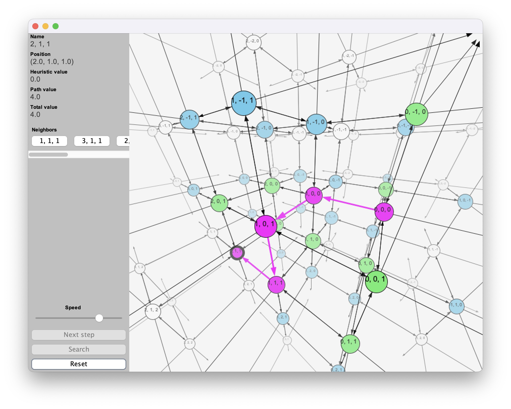
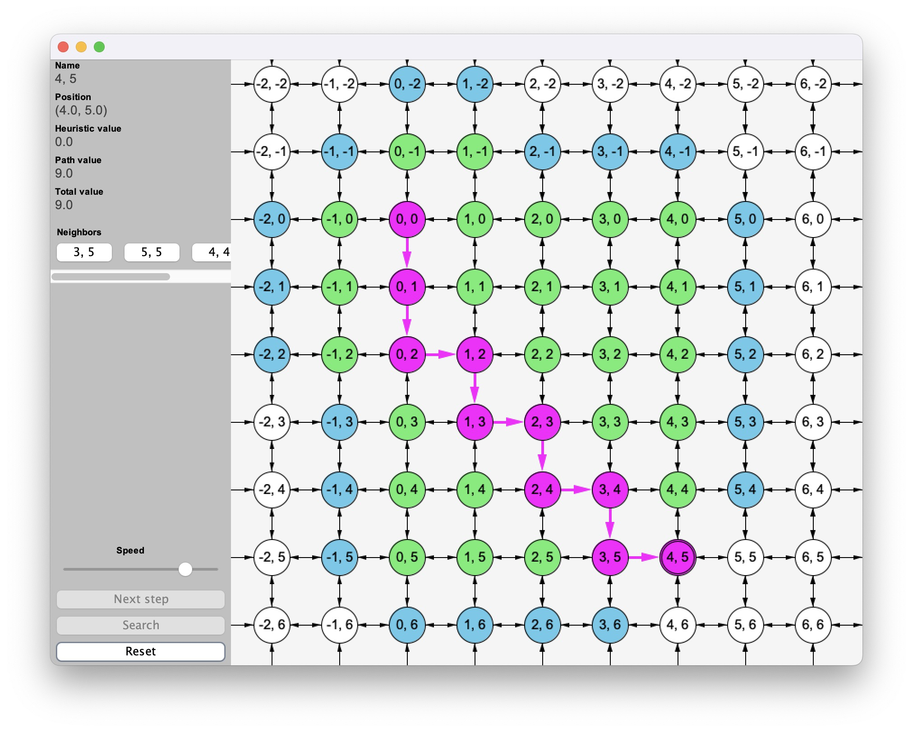

# Search Algorithms

This repository is a library containing search algorithms to find paths in State Spaces. It relies on [CS165A](https://sites.cs.ucsb.edu/~xyan/classes/CS165A-2024fall/syllabus.html) at UCSB. It is ment to serve as a help to understanding the different search algorithms, how they work and to test them out on your own. You can also experiment and add more algorithms on your own.

3D View                              |  2D View
:-----------------------------------:|:------------------------------------:
  |  

## Structure
The repository contains multple packages, each usually containing one abstract class or interface and some implementations of them. The packages are:
* [(default package)](#how-to-get-started-)
* [searchAlgorithms](#included-search-algorithms-)
* [stateSpace](#stateSpace-)
* [goalTest](#goalTester-)
* [pathEvaluation](#pathEvaluator-)
* [heuristic](#heuristic-)
* [loopHandling](#loopHandler-)
* [searchStrategy](#searchStrategy-)
* [util](#utilities-)
* [ui](#ui-)

## How to get started 🏁
Just clone the repository and make sure that a modern Java version is installed, other dipendendies are not needed. The default package of this project contains the Main.java file, which contains the main method and a couple of methods for testing the algorithms. Feel free to play around in this file. If you want to create your own SearchAlgorithm, just open the [searchAlgorithms](src/searchAlgorithms) package, add a new generic class that inherits from [GeneralSearch](#generalSearch-) and implement a constructor that calls the super constructor. You can orient yourself to the other classes in the package. The same is true if you want to add your own [SearchStrategy](#searchStrategy-), [GoalTester](#goalTest-), etc.

## GeneralSearch 🕵
All included Search Algorithms rely on the GeneralSearch algorithm. This algorithm
1. expands all neighbors of the current node
2. evaluates their desirability by adding
	* the future cost, aka. heuristic value using the [Heuristic](#heuristic-)
	* the past cost, aka. path value using the [PathEvaluator](#pathEvaluator-)
3. puts them into a [SearchStrategy](#searchStrategy-) aka. data structure (e.g., Stack for DepthFirstSearch)
4. ignores already visited nodes according to the [LoopHandler](#loopHandler-)
5. repeats those steps until the first node is discovered that according to the [GoalTester](#goalTester-) is a goal node

## Included Search Algorithms 💠
* [GeneralSearch](src/searchAlgorithms/GeneralSearch.java)
* [A\*Search](src/searchAlgorithms/AStarSearch.java)
* [UniformSearch](src/searchAlgorithms/UniformSearch.java)
* [BreadthFirstSearch](src/searchAlgorithms/BreadthFirstSearch.java)
* [DepthFirstSearch](src/searchAlgorithms/DepthFirstSearch.java)
* [BestFirstSearch](src/searchAlgorithms/BestFirstSearch.java)

## StateSpace 🗺️
The repository also contains a couple of commonly used state spaces that the Search Algorithms use as their environments. Those are:
* Cartesian
	- An n-dimensional grid. It can be of infinite size, or you can provide an n-dimensional boolean array to limit its size to the finite realm and provide the information about which nodes should be interpreted as walls and cannot be visited.
* Graph
	- A classical graph, where you specify the nodes and edges.

All State Spaces contain the following information:
* start node
* getNeighbors(Node) method
	- A method returning an ArrayList\<Node\> that contains the neighbors of the given node
* GoalTester instance
	- GoalTester is an interface with just one method: isGloal(Node)
* getCost(Node, Node) method
	- A method to determine the cost for traveling from Node a to Node b

You might notice that there is no method or variable that explicitly specifies which nodes exist. This is because a State Spaces can have infinitely many nodes. That's why this information is derived from the getNeighbors(Node) method. However, subclasses of StateSpace might implement their own variable for this, e.g., Graph has an ArrayList\<Node\> representing this information.

## GoalTester 🎯
GoalTester is a functional interface with just one method: isGoal(Node). It is being used by StateSpace to determine which nodes are the goal nodes. The repository already contains a common implementation of this interface:
* ListGoalTester
	- You pass a list of goal nodes, and it just checks whether a given node is within that list. This should be used when there is a small finite amount of goal nodes that are known a priori.

## PathEvaluator 🛣️
PathEvaluator is a functional interface with just one method: pastCost(StateSpace\<Node\>, ArrayList\<Node\>). Its job is to determine a cost value for a given path within a given StateSpace. This repository already contains some common implementations of this interface:
* SumPathEvaluator
	- This just returns the sum of all direct costs. This is the most commonly used PathEvaluator, used by A\* algorithms.
* ConstantPathEvaluator
	- This always returns a constant value and therefore basically ignores the past cost. This is used by BestFirstSearch algorithms.
* DepthPathEvaluator
	- This just returns how many nodes are in that path multiplied by a given constant and therefore ignores the costs between two nodes. This is used in BreadthFirstSearch algorithms.

## Heuristic 🤔
Heuristic is a functional interface with just one method: futureCost(StateSpace\<Node\>, Node). Its job is to estimate the desirability of the given node in the given StateSpace. This repository already contains some common implementations of this interface:
* ConstantHeuristic
	- This always returns a given constant value and therefore ignores the environment. This is used by UniformSearch algorithms.
* DistanceHeuristic
	- This returns the distance between the given node and the closest goal node according to a Measurement.

## LoopHandler 🔄
This is an interface with two methods: initialize() and shouldVisitNode(Node, ArrayList\<Node\>, double, HashMap\<Node, Double\>). The parameters represent the current node, the path to that node, the cost of the path, and a HashMap containing the information of whether any given node has been visited or not and what the cost was to reach that node. Its job is to return either true or false, indicating whether the given node should be visited or not. This repository already contains some common implementations of this interface:
* GraphLoopHandler
	- This always returns false for already visited nodes.
* TreeLoopHandler
	- This always returns true; any node can be visited, no matter if it has been visited before.
* SmartGraphLoopHandler
	- This only returns true if the node has not been visited or the past way to reach that node was more expensive than the new one.

## SearchStrategy 📚
This is an interface with just one method: add(Node, double). Its job is to put the given node into an ArrayList according to the given rating value. This represents the data structure that is used by GeneralSearch, which will always expand the first node in the ArrayList. This repository already contains some common implementations:
* BreadthFirst
	- This represents a queue, by always placing the next node at the end of the ArrayList, therefore implementing a FIFO principle.
* DepthFirst
	- This represents a stack, by always placing the next node at the start of the ArrayList, therefore implementing a LIFO principle.
* Uniform
	- This represents a sorted list, by placing the next node right behind the next smallest other node according to the rating value.

## Utilities 🔨
The repository also comes with some utility classes; those include:
* Measurement
	- An enum representing different ways to measure distance. The possible values are:
		* EUCLIDEAN
		* MANHATTAN
		* UNIFORM
		* HAMMING
* Vector
	- A class representing an n-dimensional vector.
* Position
	- An interface that should be implemented by classes that have a vector for a position. This interface allows you to use DistanceHeuristic for your own custom types that implement this interface, rather than just Vectors. This repository already contains a common implementation for this interface:
		* Point
			- A class with a position and a name, e.g., used for Graph StateSpaces.

## UI 💻
The UI consists of a StateSpaceWindow which contains a StateSpaceSidebar and a StateSpaceView. StateSpaceView is an abstract class that is being extended from StateSpaceView2D and StateSpaceView3D.